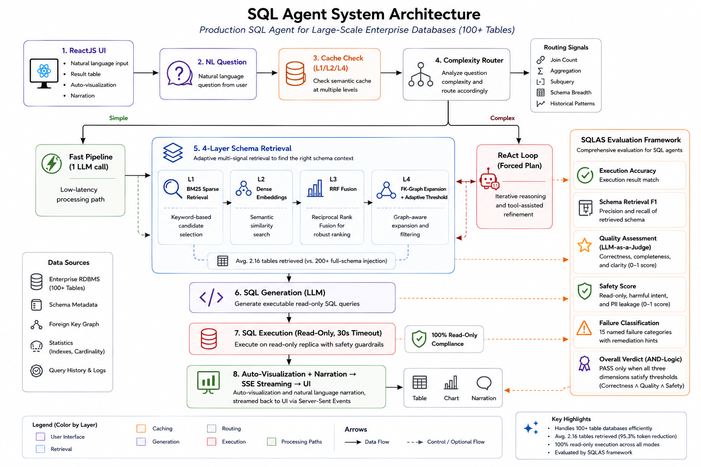

# NexusSQL: SQL AI Agent

**Natural language to SQL with multi-agent reasoning, schema-aware retrieval, and production observability.**

[](LICENSE)
[](https://www.python.org/)
[](https://fastapi.tiangolo.com/)
[](https://thepradip.github.io/NexusSQL/)

**🌐 Website:** [thepradip.github.io/NexusSQL](https://thepradip.github.io/NexusSQL/) · **Author:** [thepradip](https://github.com/thepradip)

---

## What it does

Ask a question in plain language and NexusSQL handles the rest. It writes the SQL, runs it against your database, and gives you back an answer with a chart. One API call.

- **Pipeline mode**: fast single-pass: schema → SQL → execute → narrate → visualize
- **Agentic (ReAct) mode**: multi-step reasoning: plan → inspect schema → execute → self-correct → answer
- **Visualization microservice**: deterministic chart type inference isolated from the agent
- **Multi-tenant**: per-tenant table access control and row-level filters
- **MLflow observability**: every query traced with latency, SQL complexity, cache metrics, and user feedback
- **Production cache**: semantic and exact NL→SQL cache; result cache with TTL

---

## Architecture



```
┌─────────────┐     /api/*      ┌──────────────────┐     SQL      ┌──────────┐
│  React UI   │ ──────────────► │  FastAPI Backend  │ ──────────► │  Any DB  │
│  port 80    │                 │  port 8000        │             │ SQLite / │
└─────────────┘                 └────────┬──────────┘             │ Postgres │
                                         │ HTTP                   │ MySQL    │
                                         ▼                        └──────────┘
                                ┌──────────────────┐
                                │  Visualization   │
                                │  Service 8011    │
                                └──────────────────┘
```

---

## Quickstart

### Docker (recommended)

```bash
# 1. Set credentials
cp backend/.env.example backend/.env
# edit backend/.env: fill in AZURE_OPENAI_ENDPOINT, AZURE_OPENAI_API_KEY, AZURE_OPENAI_DEPLOYMENT_NAME

# 2. Start everything
docker compose up --build
```

Three containers start in dependency order:

| Container | Port | Role |
|---|---|---|
| `ariasql-visualization` | 8011 | Chart inference microservice |
| `ariasql-backend` | 8000 | SQL AI agent API + MLflow |
| `ariasql-frontend` | 80 | React UI |

Open `http://localhost` and you're ready.

```bash
docker compose down          # stop
docker compose up            # restart (no rebuild)
docker compose up --build    # rebuild after code changes
```

### Local (no Docker)

```bash
bash start.sh
```

Starts all three services: visualization (8011) → backend (8000) → frontend dev server (5173).

---

## API

### POST /query

```bash
curl -X POST http://localhost:8000/query \
  -H "Content-Type: application/json" \
  -d '{"query": "How many patients were admitted last month?"}'
```

Response:
```json
{
  "sql": "SELECT COUNT(*) FROM admissions WHERE ...",
  "data": {"columns": [...], "rows": [...], "row_count": 1},
  "response": "142 patients were admitted last month.",
  "visualization": {"type": "number", "number_value": 142, "number_label": "Count"},
  "agent_mode": "pipeline",
  "metrics": {"total_latency_ms": 1240, "cache_hit": false}
}
```

### POST /query (agentic)

```bash
curl -X POST http://localhost:8000/query \
  -H "Content-Type: application/json" \
  -d '{"query": "Which departments have the highest readmission rates?", "force_agentic": true}'
```

Runs multi-step ReAct loop: plan → describe tables → execute SQL → self-correct → answer.

### Other endpoints

| Method | Endpoint | Description |
|---|---|---|
| `GET` | `/health` | Service health + table list |
| `GET` | `/schema` | Full database schema |
| `POST` | `/query/stream` | SSE streaming, stages in real time |
| `POST` | `/feedback` | Thumbs up/down on a trace |
| `GET` | `/cache/stats` | Cache hit rate, tokens saved |
| `POST` | `/export/csv` | Download results as CSV |
| `POST` | `/database/test` | Test a new database connection |
| `GET` | `/drift/status` | Production drift monitoring status |

Full docs at `http://localhost:8000/docs`.

---

## Configuration

All config lives in `backend/.env`. Key variables:

```bash
# Required
AZURE_OPENAI_ENDPOINT=https://your-resource.openai.azure.com/
AZURE_OPENAI_API_KEY=your-key
AZURE_OPENAI_DEPLOYMENT_NAME=gpt-4o
DATABASE_URL=sqlite+aiosqlite:///./health.db

# Optional
AZURE_OPENAI_EMBEDDING_DEPLOYMENT=text-embedding-ada-002  # enables semantic cache
CACHE_ENABLED=true
RESULT_CACHE_TTL=300
DOMAIN_HINT=Healthcare analytics database with patient records
LARGE_SCHEMA_THRESHOLD=20   # tables above this use semantic retrieval
VISUALIZATION_SERVICE_URL=http://127.0.0.1:8011
```

---

## Visualization Service

SQL chart inference runs as a separate FastAPI microservice so the agent is never blocked by chart logic:

```
services/visualization_service/
├── app.py          GET /health, POST /v1/visualizations/infer
├── inference.py    Deterministic bar/line/pie/scatter/number selection
├── validation.py   Renderability and data-alignment checks
└── schemas.py      Versioned Pydantic contracts
```

The backend calls it via `backend/visualization_client.py` with a 2-second timeout. If the service is unavailable, SQL answers still return, just without a chart.

---

## Evaluation

NexusSQL ships with [SQLAS](https://pypi.org/project/sqlas/), a production evaluation framework for Text-to-SQL agents.

```bash
pip install sqlas
```

See [`sqlas/README.md`](sqlas/README.md) for full documentation.

---

## Project layout

```
backend/                    FastAPI agent: SQL generation, execution, caching, tracing
frontend/                   React + Vite + Tailwind UI
services/
  visualization_service/    Chart inference microservice
sqlas/                      SQLAS evaluation library (pip install sqlas)
sqlas-ui/                   React evaluation dashboard
docker-compose.yml          Orchestrates all three containers
start.sh                    Local dev startup script
```

---

## License

MIT, by [thepradip](https://github.com/thepradip)
